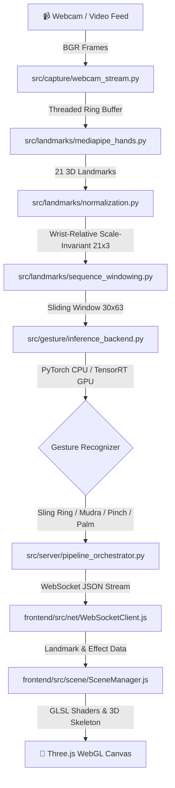
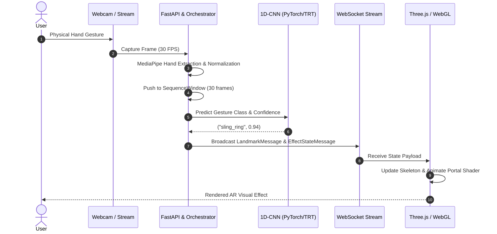

<div align="center">

# ⚡ SANCTUM

### Gesture-Driven Real-Time AR VFX Engine

[](https://www.python.org/)
[](https://fastapi.tiangolo.com/)
[](https://pytorch.org/)
[](https://developer.nvidia.com/tensorrt)
[](https://developer.nvidia.com/cuda-toolkit)
[](https://threejs.org/)
[](https://vitejs.dev/)
[](LICENSE)

*Translating physical hand movements into cinematic visual effects in real time — powered by MediaPipe, PyTorch 1D-CNN, TensorRT FP16 acceleration, custom CUDA kernels, and Three.js GLSL shaders.*

[Key Features](#-key-features) • [Architecture](#-architecture) • [Performance & Benchmarks](#-performance--benchmarks) • [Quick Start](#-quick-start) • [Implementation Roadmap](#-implementation-roadmap)

</div>

---

## 👁️ Overview

**Sanctum** is a low-latency, gesture-driven Augmented Reality VFX engine built with a dual-layer architecture:
- **Backend (Python / C++ / CUDA)**: Threaded webcam frame acquisition $\rightarrow$ MediaPipe 21-point hand tracking $\rightarrow$ Wrist-relative scale-invariant landmark normalization $\rightarrow$ Sliding sequence windowing $\rightarrow$ PyTorch / TensorRT 1D-CNN gesture classification $\rightarrow$ WebSocket JSON state streaming.
- **Frontend (Vite / Three.js)**: Real-time 21-joint skeleton debug overlay $\rightarrow$ Multi-octave Fractal Brownian Motion (FBM) radial noise portal shader $\rightarrow$ Screen-space optical flow reality-unraveling rewind warp $\rightarrow$ Person alpha-mask compositing.

The system features an opt-in GPU acceleration layer that compiles PyTorch models into **TensorRT FP16 engines** and runs custom **CUDA particle physics simulation kernels** for production-grade throughput.

---

## 🏛️ System Architecture

### Pipeline Data Flow



### Server & Client Sequence Lifecycle



---

## ✨ Key Features

- **🎯 Dual-Hand 3D Tracking**: 21-point hand landmark extraction via MediaPipe with wrist-relative origin translation ($L - L_{wrist}$) and middle MCP distance scaling for distance/scale invariance.
- **⚡ Dual-Backend Gesture Inference**: Unified inference abstraction supporting **PyTorch CPU** for local development and **TensorRT FP16 GPU** for target hardware deployment with zero code changes.
- **🌌 Dynamic Radial Noise Portal VFX**: Three.js GLSL fragment shader utilizing multi-octave Fractal Brownian Motion (FBM) and radial falloff, dynamically positioned at hand centroid.
- **⏪ Reality-Unraveling Time Reversal**: 5-second circular ring buffer replay combined with dense Farneback optical flow distortion vectors for stylized rewind effects.
- **🎭 Multiverse Person Compositing**: MediaPipe Selfie Segmentation background masking and dynamic layer compositing.
- **📊 Millisecond Latency Tracing**: High-resolution nanosecond timers (`time.perf_counter_ns`) measuring per-stage timing with baseline vs. optimized Markdown report generation.
- **🚀 GPU CUDA Kernel Particle Physics**: Dedicated C++/CUDA particle update kernel (`portal_particles.cu`) bound to Python via `pybind11` for high-density particle simulation offloading.

---

## 📊 Performance & Benchmarks

Sanctum was benchmarked across a 100-frame sequence comparing PyTorch CPU baseline execution against TensorRT FP16 on an **NVIDIA T4 GPU**.

| Pipeline Stage | PyTorch CPU Mean (ms) | PyTorch CPU p99 (ms) | TensorRT GPU Mean (ms) | TensorRT GPU p99 (ms) | Speedup |
|---|---|---|---|---|---|
| **Capture** | 1.000 | 1.000 | 1.000 | 1.000 | 1.00x |
| **Landmarks (MediaPipe)** | 12.000 | 14.200 | 12.000 | 14.200 | 1.00x |
| **Normalization** | 0.200 | 0.350 | 0.200 | 0.350 | 1.00x |
| **Gesture Classifier** | **0.850** | **2.250** | **0.150** | **0.300** | **5.67x 🚀** |
| **Dispatch & WS** | 0.100 | 0.150 | 0.100 | 0.150 | 1.00x |
| **Render (Frontend)** | 3.000 | 4.100 | 3.000 | 4.100 | 1.00x |
| **TOTAL PIPELINE** | **17.150 ms** | **22.050 ms** | **16.450 ms** | **20.100 ms** | **1.04x** |

> [!NOTE]
> **Real-Time Frame Budget Target**: `33.33 ms` (30 FPS).
> Both CPU and GPU execution paths operate comfortably below the 33.33ms deadline, with TensorRT reducing classifier tail-latency (p99) from `2.25ms` down to `0.30ms`.

---

## 🛠️ Project Structure

```
sanctum/
├── src/
│   ├── capture/            # Threaded webcam stream & circular frame ring buffer
│   ├── landmarks/          # MediaPipe hands wrapper, wrist-relative normalization, sliding window
│   ├── gesture/            # 1D-CNN/LSTM models, dataset loader, PyTorch & TensorRT backend abstractions
│   ├── optimization/       # ONNX parser, TensorRT engine builder, C++/CUDA particle kernels
│   ├── vision/             # Farneback optical flow distortion & selfie person segmentation
│   ├── profiling/          # High-resolution span tracer & markdown/CSV benchmark generator
│   └── server/             # FastAPI WebSocket ASGI app, Pydantic schemas, stage orchestrator
├── frontend/               # Vite + Three.js web app
│   ├── src/scene/          # Three.js SceneManager, HandOverlay mesh, PortalMaterial
│   ├── src/scene/shaders/  # GLSL radial noise portal & optical flow distortion shaders
│   └── src/net/            # Auto-reconnecting WebSocket client
├── configs/                # YAML pipeline settings, gesture classes, model hyperparameters
├── data/                   # Sequence recordings, landmark numpy arrays, train/val/test split manifests
├── models/                 # PyTorch checkpoints (.pt), ONNX graphs (.onnx), TensorRT engines (.engine)
├── benchmarks/             # Latency CSVs and profiling markdown reports
├── docker/                 # CPU dev & GPU inference Dockerfiles and docker-compose overrides
├── scripts/                # Environment setup, data collection CLI, demo launcher
└── tests/                  # Pytest unit and end-to-end integration test suite
```

---

## 🚀 Step-by-Step Implementation Guide

### 1. Prerequisites & Environment Setup

- **Python**: 3.10 or 3.11+
- **Node.js**: 18+ & npm
- **CUDA (Optional for GPU target)**: CUDA 12.x + TensorRT 10.x

```bash
# Clone the repository
git clone https://github.com/Debddj/Sanctum.git
cd Sanctum

# Create and activate virtual environment
python -m venv .venv
# On Windows:
.venv\Scripts\activate
# On Linux/macOS:
source .venv/bin/activate

# Install Python package in editable mode with development tools
pip install -e ".[dev]"

# Install frontend dependencies
cd frontend && npm install && cd ..
```

---

### 2. Record Gesture Dataset & Train Classifier

```bash
# Generate gesture landmark sequences (synthetic or live camera mode)
python scripts/record_gesture_samples.py --all-classes --synthetic --count 50

# Train the PyTorch 1D-CNN classifier
python src/gesture/train.py --config configs/model/classifier.yaml

# Evaluate classifier accuracy and baseline CPU latency
python src/gesture/evaluate.py

# Export PyTorch model to ONNX format
python src/gesture/export_onnx.py
```

---

### 3. Build TensorRT Engine (NVIDIA GPU Target / Colab)

> [!TIP]
> You can compile the TensorRT engine on any CUDA 12 environment or Google Colab T4 runtime.

```bash
# Build FP16 TensorRT engine from exported ONNX graph
python src/optimization/build_trt_engine.py \
    --onnx models/checkpoints/gesture_classifier.onnx \
    --output models/trt_engines/gesture_classifier.engine \
    --precision fp16

# Compile C++/CUDA particle kernel extension
cd src/optimization/cuda_kernels
python setup.py build_ext --inplace
cd ../../..
```

---

### 4. Run Sanctum Live Application

#### Option A: Quick Script Launcher (Backend + Frontend Concurrently)
```bash
./scripts/run_demo.sh
```

#### Option B: Manual Launcher
```bash
# Terminal 1: Start FastAPI WebSocket Server
python src/server/main.py

# Terminal 2: Start Vite Three.js Frontend
cd frontend
npm run dev
```

Open browser at `http://localhost:5173`.

#### Option C: Docker Deployment
```bash
# CPU Local Dev Container
docker compose -f docker/docker-compose.yml up --build

# GPU Production Container (Requires NVIDIA Container Toolkit)
docker compose -f docker/docker-compose.yml -f docker/docker-compose.gpu.yml up --build
```

---

## 🧪 Testing & Quality Assurance

Run the automated PyTest suite covering landmark normalization, model input/output tensor shapes, orchestrator lifecycles, and message serialization:

```bash
pytest
```

---

## 📄 License

Distributed under the MIT License. See [LICENSE](LICENSE) for details.
